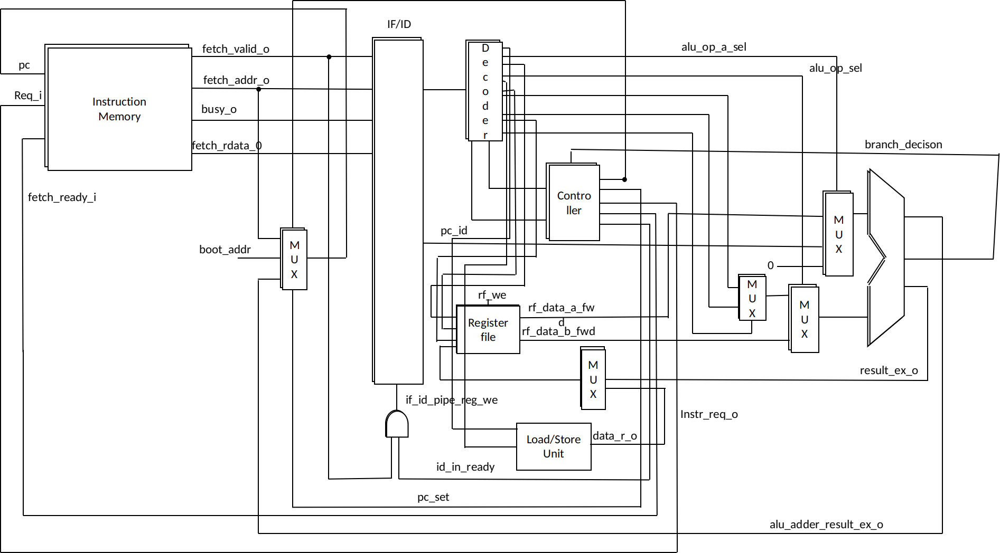
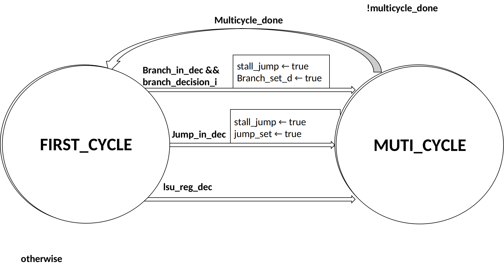
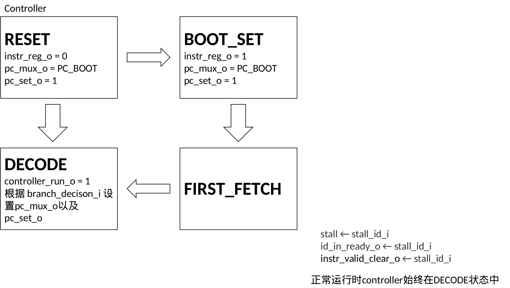

This is the assignment for the course Principles of Computer Organization. We have refactored [Ibex](https://github.com/lowRISC/ibex) with Chisel.
It is a huge project and we can only finish part of it within limited time.

# CPU 设计文档

## 概述

> Ibex was initially developed as part of the [PULP platform](https://www.pulp-platform.org) under the name ["Zero-riscy"](https://doi.org/10.1109/PATMOS.2017.8106976), and has been contributed to [lowRISC](https://www.lowrisc.org) who maintains it and develops it further. It is under active development.

Ibex 是一个产品级的 32 位两极流水的开源 RISC-V 处理器，支持  RV32I、RV32C、RV32M、RV32B 等拓展，支持了 M-Mode 和 U-Mode，完整实现了 RISC-V  指令集规定的控制状态寄存器、中断异常、调试支持等，适用于嵌入式系统。

本小组参考 Ibex 原理，实现了一个简化版的 Ibex，具体简化如下：

- 使用 Ibex 默认配置
- 不支持异常/中断
- 不支持指令高速缓冲（*Instruction Cache*）和预取缓冲区（*Prefetch Buffer*）
- 不支持特权级模式（M-Mode、S-Mode、U-Mode、H-Mode）
- 不支持性能计数器（*Performance Counter*）和调试模式（*Debug Mode*）
- 不支持非对齐的内存访问
- 不支持压缩指令（RV32C）

## 流水线

本 CPU 的流水线完全按照 Ibex 的流水线设计，支持两极流水，分为 IF 阶段和 ID 阶段。

指令IF 阶段，处理器从 Instruction Memory 中取指令（地址 4 字节对齐），并将指令及相关控制信号传递给 IF/ID 流水线寄存器。PC 在 IF 阶段设置，不进行分支预测。

ID 阶段，处理器进行寄存器读写、内存读写、算术逻辑运算等功能。处理器从 IF/ID 流水线寄存器中接受 IF 阶段生成的控制信号和指令，译码器对指令译码，译码器信号部分信号直接传递给 ALU 以控制其运算，部分信号传递给控制器，控制器负责生成控制信号控制流水线工作。

ALU 可以接收地址进行计算，生成跳转指令的目标地址供 IF 阶段修改 PC。

## PC 的修改

PC 的修改有三种可能：

- jump 或 branch 指令
- 启动时指向 boot_addr
- 顺序执行时 PC + 4

PC 的修改通过多选器完成，当

- IF/ID 流水线寄存器可写、使能多选器且选择 jump/branch 地址时，PC 设置为 jump/branch 地址
- IF/ID 流水线寄存器可写、未使能多选器时 PC + 4

## 数据通路

## ID 阶段状态机

## 控制器状态机

## 流水线停顿

流水线的停顿由 ID 阶段生成的 stall 信号控制，stall 为 1，则流水线停顿，为 0 则不停顿。stall 为 1 时，IF/ID 流水线寄存器将被禁止写，从而确保 ID 使用正确的指令/数据。

流水线的停顿有以下几个原因：

- 内存操作（即 LSU 请求）
- jump 指令
- 成功跳转的 branch 指令
- 多周期的 ALU 指令（在我们的版本中不存在）

ID 阶段综合以上四个原因生成 stall 信号，以上四种原因发生时的情形：

- 内存操作：发送请求但未受到完成信号
- jump 指令：译码器译码得到 jump 指令就知道需要停顿流水线
- branch 指令：译码器译码得到 branch 指令，并且需要跳转（ALU 输出的 branch_decision 为 1）
- 多周期 ALU 指令：ALU 繁忙

## 多周期指令

在本实现中，ALU 仅支持单周期的指令，仅有内存操作（LSU 请求）可能是多周期的。这在一定程度上简化了实现。
